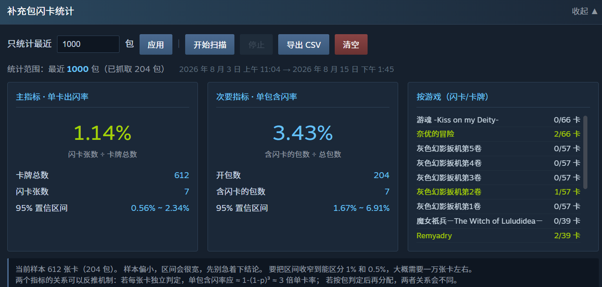

# Steam 补充包闪卡统计

统计 Steam 补充包开出闪卡的**实际概率**。

网上关于闪卡掉率的说法一直没有定论，掉率逻辑跑在 Valve 服务器上，客户端拿不到。
唯一能接近答案的办法是统计——这个脚本自动扫描你的库存历史，
把每一次开包的结果记下来，算出观测掉率和置信区间。



---

## 安装

1. 装浏览器扩展 [Tampermonkey](https://www.tampermonkey.net/)（Chrome / Edge / Firefox 都支持）
2. 点击下面的链接安装脚本：

   ```
   https://raw.githubusercontent.com/Gravity2000/steam-foil-stats/main/steam-foil-stats.user.js
   ```

   油猴会自动弹出安装页面，点「安装」即可。

## 使用

1. 打开 <https://steamcommunity.com/my/inventoryhistory/>
2. 页面顶部会出现统计面板
3. 点「开始扫描」，脚本自动翻页抓取，每页间隔 4 秒
4. 扫描期间**保持页面打开**（可以切到其他标签页）
5. 之后再次扫描会自动增量更新，连续 3 页没有新数据就停

### 只统计最近 N 包

面板上有个输入框，填数字就只统计最近 N 包，留空则统计全部。

这个设置同时管两件事：

- **扫描时提前停** —— 抓够 N 包就不再翻页，不用等全量扫描
- **统计时只算最近 N 包** —— 老数据不删，只是不参与计算

所以可以先全量扫一遍，之后随意切换 100 / 500 / 全部来看不同区间的结果。

---

## 结果怎么看

### 两个指标

| 指标 | 算法 | 说明 |
|---|---|---|
| **单卡出闪率** | 闪卡张数 ÷ 卡牌总数 | 主指标。一包 3 张卡 = 3 次机会，分母用卡牌数 |
| **单包含闪率** | 含闪卡的包数 ÷ 总包数 | 次要指标 |

两个都记录是有原因的：**它们的关系可以反推掉率机制**。

- 若**每张卡独立判定**，单包含闪率应该 ≈ 1-(1-p)³ ≈ 3 倍单卡率
- 若**按包判定后再决定给哪张卡**，两者的关系会不同

这正是社区争议的点之一，有足够样本时可以用数据说话。

### 置信区间比百分比重要

样本小的时候，观测到的百分比几乎没有意义。

300 张卡里出 3 张闪卡，观测值 1%，但 95% 置信区间大约是 **0.3% ~ 2.9%** ——
真实值是 0.5% 还是 2.5%，这份数据都无法排除。

样本量和区间宽度的关系（观测率 1% 时）：

| 卡牌数 | 约等于包数 | 95% 区间 |
|---|---|---|
| 300 | 100 | 0.3% ~ 2.9% |
| 1,500 | 500 | 0.6% ~ 2.0% |
| 6,000 | 2,000 | 0.8% ~ 1.3% |
| 15,000 | 5,000 | 0.9% ~ 1.2% |

想验证「单卡出闪率到底是不是 1%」，大概需要一万张卡以上。
每款游戏每天只能做一个包，所以这是个**长期项目**，先把管道跑起来慢慢攒。

> 顺带一提：如果你连开一百包没出闪卡，别急着怀疑人品。
> 假设真实掉率是每包 1%，连续 100 包不中的概率约 **36.6%** ——
> 三个人各开一百包，大概就有一个和你一样。每包判定独立，没有保底，
> 前面连续多少包不中都不会提高下一包的概率。

---

## 关于隐私和安全

这个脚本：

- **只读**库存历史页面，不发起任何交易、不修改库存、不动任何物品
- **不上传任何数据**，所有统计结果存在浏览器本地（`GM_setValue`）
- **不需要账号密码**，用的是你浏览器里已登录的会话
- 代码全部公开在本仓库，482 行，可以自己审

导出的 CSV 也是在你本地生成的，没有服务端参与。

---

## 已知限制

**Steam 库存历史只保留有限时间**（通常几个月）。更早的开包记录已经查不到，
无论怎么翻页都拿不回来。第一次扫描能抓到多少就是多少，之后靠增量积累。

**翻页太快会被限流**（HTTP 429），脚本会自动等 60 秒重试。默认每页间隔 4 秒，
不建议改小。

**Steam 改版会导致解析失效。** 脚本依赖库存历史页面的 DOM 结构，
如果 Valve 改了页面，需要更新选择器。遇到扫描不出数据请提 issue。

---

## 解析规则

- 只统计事件描述含 `已拆开补充包` / `Unpacked booster pack` 的记录
- **挂卡掉落会被排除** —— 挂卡（「因游戏时数而获取」）也能掉闪卡，
  混进来会污染结果，这是最容易出错的地方
- 闪卡判定：卡牌名称含 `(闪亮)` 或 `(Foil)`
- 去重靠每条记录的 `history<hash>` ID，所以重复扫描不会重复计数
- 中英文界面都支持，切换语言不影响统计

---

## 更新日志

### v1.1.0
- 面板改为嵌入式（原为悬浮窗）
- 主指标改为单卡出闪率，单包含闪率作为次要指标保留
- 新增「只统计最近 N 包」设置
- 新增按游戏分组的统计

### v1.0.0
- 首个版本

---

## License

MIT
